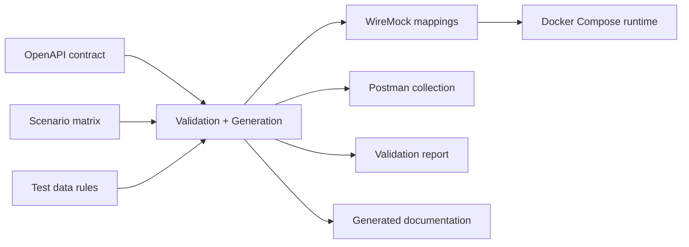

# llm-autogenerate-sv

A professional Service Virtualization project demonstrating deterministic generation of WireMock assets from an approved OpenAPI contract, QA scenario matrix, and synthetic test data rules. Built for a synthetic healthcare Eligibility API.

Created by **Anzar Ahsan** as a reference implementation for enterprise API governance and mock service automation.

## Why this project matters

In regulated and cross-team environments, API contracts and mocking behavior must follow strict change control. This project demonstrates a clean separation of concerns:

- The OpenAPI contract is the definitive specification of API structure and supported response codes.
- The scenario matrix defines test coverage and mock behavior for business conditions.
- Generated artifacts (WireMock mappings, documentation, reports) are reproducible and traceable back to source inputs.

This approach ensures auditability, maintainability, and professional-grade API governance—critical for regulated healthcare systems and enterprise service virtualization workflows.

## Architecture



## What it generates

- `generated/wiremock/mappings/` — WireMock mapping JSON assets by scenario
- `generated/wiremock/__files/` — generated response payload assets
- `generated/postman/eligibility-api.postman_collection.json` — Postman collection for scenario requests
- `generated/reports/validation-report.md` — generation validation and source-of-truth report
- `generated/docs/README.md` — generated documentation summary

## Tech stack

- Python 3.11+
- PyYAML
- requests
- pytest
- WireMock Docker
- Docker Compose
- YAML and JSON artifacts

## Repository layout

- `input/` — sample approved OpenAPI YAML, scenario matrix, and synthetic rules
- `sv_generator/` — generation engine, validation, and CLI
- `generated/` — generated mappings, collection, reports, and docs
- `tests/` — unit and smoke tests
- `.github/workflows/` — GitHub Actions workflow for CI

## Quickstart

### 1. Install dependencies

```bash
python3 -m pip install -r requirements.txt
```

### 2. Generate assets

```bash
python -m sv_generator.cli generate \
  --openapi input/openapi/eligibility-api-v1.yaml \
  --scenarios input/scenarios/eligibility-scenarios.yaml \
  --rules input/test-data-rules/eligibility-data-rules.yaml \
  --output generated
```

or with `make`:

```bash
make generate
```

### 3. Start the WireMock runtime

```bash
docker-compose up
```

or with the wrapper script:

```bash
./scripts/start-wiremock.sh
```

### 3b. Start the local Python mock runtime

```bash
python -m sv_generator.cli serve --mappings generated/wiremock/mappings --host 127.0.0.1 --port 8089
```

or:

```bash
./scripts/run-local-mock.sh generated/wiremock/mappings
```

### 4. Call the mock endpoints

```bash
curl http://localhost:8089/api/v1/eligibility/M1001
curl http://localhost:8089/api/v1/eligibility/M1002
curl http://localhost:8089/api/v1/eligibility/M9999
curl http://localhost:8089/api/v1/eligibility/M5000
curl http://localhost:8089/api/v1/eligibility/INVALID
```

### 5. Run tests

```bash
pytest -q -m 'not smoke'
```

Run smoke tests after either WireMock or the local Python mock server is running:

```bash
pytest -m smoke
```

or with `make`:

```bash
make test
make smoke
```

## Source of truth

This project is intentionally designed so that the contract and behavior inputs are authoritative:

- OpenAPI is the source of truth for API structure, path templates, request methods, and response status codes.
- The scenario matrix is the source of truth for observable mock behavior.
- Synthetic rules provide deterministic test data constraints.
- Generated WireMock mappings, Postman collection, reports, and docs are derived artifacts.

Note: WireMock is open-source, so no paid product is required to run this project. For maximum portability, the repository also includes a pure-Python local mock runtime that can serve the generated mappings without Docker.

## Description

A reference implementation showing how to systematically generate Service Virtualization assets from approved API contracts and scenario definitions. The project emphasizes separation of concerns: source inputs are authoritative, and generated outputs are reproducible.

Key features:
- Validation-first generation from OpenAPI and scenario matrix
- WireMock mapping generation with support for complex scenarios
- Postman collection export for team collaboration
- Local Python mock runtime (no Docker required)
- Comprehensive smoke and unit tests
- YAML-based configuration for easy customization

## Architecture and design philosophy

This project applies engineering discipline to a real-world problem: generating consistent, auditable mock services from approved contracts and test scenarios.

**Design principles:**
- Contracts are authoritative (OpenAPI defines the API structure)
- Scenarios are authoritative (matrix defines expected behaviors)
- Generation is deterministic (same inputs always produce identical outputs)
- Outputs are derived (never manually edit generated files; edit the source inputs instead)
- Everything is version-controlled and reviewable

This makes the codebase suitable for CI/CD pipelines, code review workflows, and regulatory environments where traceability matters.

## Future enhancements

- Enhanced OpenAPI validation (parameter validation, schema enforcement)
- Contract testing framework integration (Pact, Spring Cloud Contract)
- WireMock Cloud deployment support
- API catalog integration (Backstage, MuleSoft Exchange)
- Coverage reporting and scenario gap analysis
- Schema-aware payload validation for generated responses
- Migration tooling for existing WireMock projects
- Performance profiling and latency analysis for mocked scenarios
